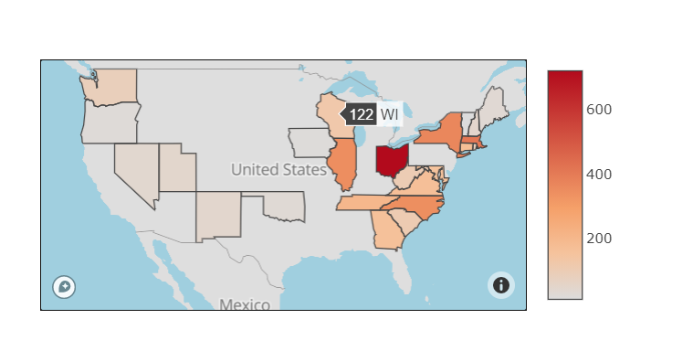
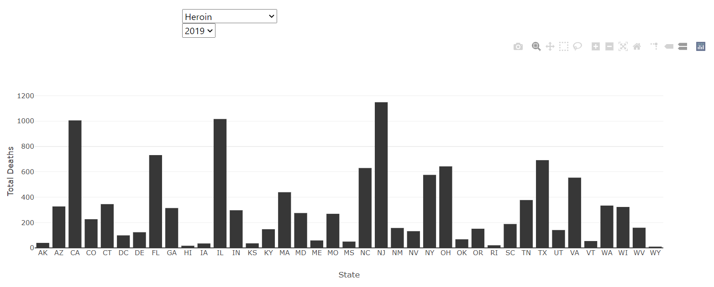
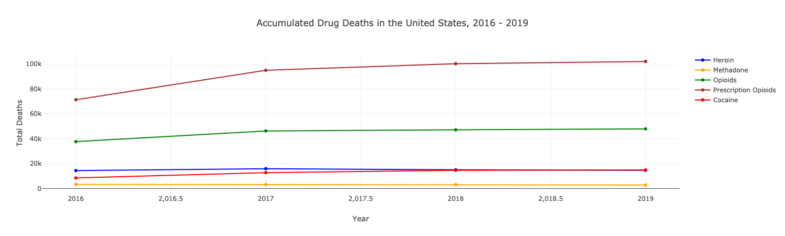
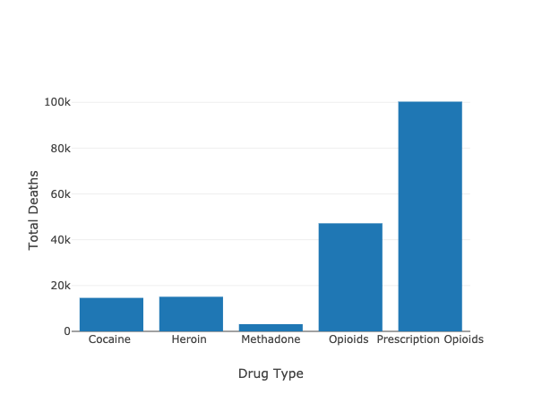

# Drug Overdose trends in the United States

### Visualization link: 
http://drug-study.herokuapp.com/

### Language
Python| HTML | JavaScrip | Jupyter NoteBook

### Introduction
In the past 3 decades, drug overdoses have killed approximately 870,000 people. Since first wave of the opioid epidemic began in the 1990s, the epidemic has expanded to include other synthetic, illicit drugs, including heroin and fentanyl. As new CDC data and other studies offer updates on the epidemic. 

### Methodology
This repository contains analytic code, findings and charts. Specifically, this repository processes and analyzes the CDC's drug overdose death data by year, geography, and specific drug combinations.

###	What data sources we chose, and why?
The analyses in this repository use " Cause of Death" data from the Healthdata.gov, which collects mortality data by state, time, geography and drug type. 
It is a readily accessible dataset with data regarding drug overdoses across the United States state with the ability to download into CSV. 
This dataset stratified by 3 key categories:
Month and Year (available from January 2016 thru December 2019)
State (Washington DC stats are also included)
Drug types (Cocaine, Heroin, Meth, prescription opioids, psychostimulants)

### The CDC
https://healthdata.gov/dataset/vsrr-provisional-drug-overdose-death-counts
Overdose or “drug poisoning” deaths as: "deaths resulting from unintentional or intentional overdose of a drug, being given the wrong drug, taking a drug in error, or taking a drug inadvertently."

### State reporting quality
The quality of data reported by medical examiners varies by state. The CDC has noted that some states have a tendency to report drug poisoning deaths without listing a specific drug. 
The analyses below incorporate this research to identify states that have higher death rate as a result of overdose in the United States from 2016-2019. 

### Detailing the process of the extraction, transformation, and loading steps 

The drug data was downloaded from healthdata.gov website as a CSV file.  This was then opened in the Jupyter lab as a Pandas Dataframe. Next, we performed the data cleaning in Pandas by keeping only the columns needed for our project as shown in the Jupyter lab. We checked to see if there were null values in our drug data. There were 27,380 rows out of 34,945 rows with null data. Since we are interested in state overdose death count in relation to our data by state, we dropped all rows that contain null values in the state column. We now have 7,565 rows without null data in relation to the state column.  Since, null data was indicated in year 2015 column, we dropped 2015 column. 

Since we used SQL Postgres database-- a connection was made to the local database in Postgres. One table was created: “Drug_data”  The data was then transferred into SQL successfully.

#### Why Postgress SQL Database?
The data type we chose for this project are all structured data and are related. In addition, joining the tables will allow us to provide meaningful insights and analyses beyond what is reflected in each individual table as demonstrated by some of the use cases outlined. 

### Why did we use Flask?

We used this application to compile modules and libraries which also help as connect it to HTML and Heroku.

# Findings

The primary trend for the observed period is in the period from 2016-2019, which outlines the death rate nationwide in that timeframe. 
#### Comparison of Overdose Deaths by Year

Looking more specifically into the sample of states discussed. Prescription drug overdose rates are higher among other drug types

#### Project -2
#### Group 12
#### Prepared by Shimsy Varkey, Sam Jebreen, Justin Chow, Zhanna Kirbakayeva
### @2020
